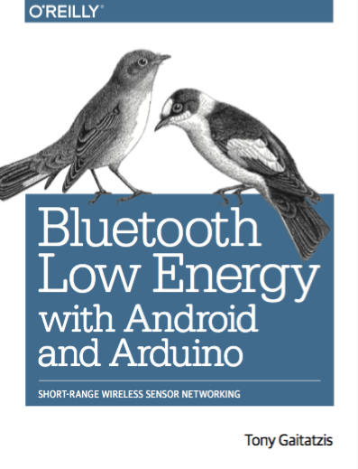

Bluetooth Low Energy with Android and Arduino
========================================================

These are **complete downloadable code examples** from my book, _Bluetooth Low Energy with Android and Arduino_ (<url>).  The book teaches how to make Bluetooth Low Energy devices talk using Arduino in Java and Android in C++.

If you find these examples helpful and you haven't purchased the book, please consider doing so.

Organization
-------------
Each chapter of this book teaches a new concept in Bluetotoh Low Energy Programming, from turning on the radio to usable example projects.

The code is available in the following repositories:

[Chapter 3: Bootstrapping] (https://github.com/OReillyBleAndroidArduino/Chapter03)

[Chapter 4: Saying Hello] (https://github.com/OReillyBleAndroidArduino/Chapter04)

[Chapter 5: Shaking Hands] (https://github.com/OReillyBleAndroidArduino/Chapter05)

[Chapter 6: Services and Characteristics] (https://github.com/OReillyBleAndroidArduino/Chapter06)

[Chapter 7: Send Data to Central] (https://github.com/OReillyBleAndroidArduino/Chapter07)

[Chapter 8: Send Data to Peripheral] (https://github.com/OReillyBleAndroidArduino/Chapter08)

[Chapter 9: Notifications] (https://github.com/OReillyBleAndroidArduino/Chapter09)

[Chapter 10: Large Data] (https://github.com/OReillyBleAndroidArduino/Chapter10)

Fair Use
--------

The book itself is copyrighted material, published under an MIT License. The license allows you to modify and reuse, and distribute this code for private or commercial use.

Generally, you may use this code in your programs and documentation without my permission, unless you are reproducing a significant portion of the code.  For example, writing a program that uses several chunks of code from this repository does not require permission. Selling or distributing a CD-ROM of examples from this repository does require permission. Answering a question by citing this material and quoting example code does not require permission. Incorporating a significant amount of example code from this repository into your product’s documentation does require permission.

- Tony Gaitatzis (<backupbrain@gmail.com>)

MIT License
------------

Copyright (c) [2016] [Tony Gaitatzis] (<backupbrain@gmail.com>)

Permission is hereby granted, free of charge, to any person obtaining a copy
of this software and associated documentation files (the "Software"), to deal
in the Software without restriction, including without limitation the rights
to use, copy, modify, merge, publish, distribute, sublicense, and/or sell
copies of the Software, and to permit persons to whom the Software is
furnished to do so, subject to the following conditions:

The above copyright notice and this permission notice shall be included in all
copies or substantial portions of the Software.

THE SOFTWARE IS PROVIDED "AS IS", WITHOUT WARRANTY OF ANY KIND, EXPRESS OR
IMPLIED, INCLUDING BUT NOT LIMITED TO THE WARRANTIES OF MERCHANTABILITY,
FITNESS FOR A PARTICULAR PURPOSE AND NONINFRINGEMENT. IN NO EVENT SHALL THE
AUTHORS OR COPYRIGHT HOLDERS BE LIABLE FOR ANY CLAIM, DAMAGES OR OTHER
LIABILITY, WHETHER IN AN ACTION OF CONTRACT, TORT OR OTHERWISE, ARISING FROM,
OUT OF OR IN CONNECTION WITH THE SOFTWARE OR THE USE OR OTHER DEALINGS IN THE
SOFTWARE.